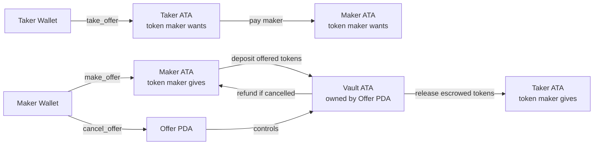

# Anchor Escrow

Production-minded Solana escrow built with Anchor.

This repo is a fixed-price token escrow.

- A maker opens an offer
- The maker's offered tokens move into a program-controlled vault
- A taker can accept the offer by paying the requested token
- The program settles both sides atomically
- The maker can cancel an open offer and reclaim funds

## What It Is

This program implements three instructions:

1. `make_offer`
2. `take_offer`
3. `cancel_offer`

State model:

- `Offer`
  - `id`
  - `maker`
  - `taker`
  - `mint_maker_gives`
  - `mint_maker_wants`
  - `amount_maker_gives`
  - `amount_maker_wants`
  - `status`
  - `bump`

Token custody model:

- The maker's offered tokens are moved from the maker ATA into a vault ATA
- The vault ATA is owned by the `offer` PDA
- On fill:
  - taker pays maker
  - vault pays taker
  - vault closes
  - offer closes
- On cancel:
  - vault refunds maker
  - vault closes
  - offer closes

## High-Level Flow



## Architecture

Program:

- Anchor program in [`programs/swap/src/lib.rs`](programs/swap/src/lib.rs)

Instructions:

- [`make_offer.rs`](programs/swap/src/instructions/make_offer.rs)
- [`take_offer.rs`](programs/swap/src/instructions/take_offer.rs)
- [`cancel_offer.rs`](programs/swap/src/instructions/cancel_offer.rs)

State:

- [`offer.rs`](programs/swap/src/state/offer.rs)

Errors:

- [`error.rs`](programs/swap/src/error.rs)

Events:

- [`events.rs`](programs/swap/src/events.rs)

## Security and Invariants

Main invariants enforced by the program:

1. Offer amounts must be greater than zero
2. Give mint and want mint must be different
3. Only the correct maker-derived `offer` PDA can control the vault
4. The passed mints must match stored offer state
5. The maker cannot take their own offer
6. Only open offers can be taken or cancelled
7. On successful settlement or cancel, escrow accounts are closed

ATA design:

- The program currently uses canonical ATAs in instruction constraints
- This keeps token routing simple and predictable
- It does not use arbitrary token accounts for user token custody

## Commands

Build:

```bash
pnpm run build:program
```

Run LiteSVM integration tests:

```bash
pnpm run test:litesvm
```

Run Rust Mollusk tests:

```bash
pnpm run test:mollusk
```

Run compute unit bench:

```bash
pnpm run bench:cu
```

Run the full local verification flow:

```bash
pnpm run verify:solana
```

## Test Coverage

### LiteSVM

Current LiteSVM suite: `15 passing`

Covered flows:

cancel_offer
✔ refunds the maker and closes escrow accounts
✔ fails for a non-maker
✔ fails after the offer was already cancelled
✔ prevents taking an offer after it was cancelled

make_offer
✔ stores offer state and moves funds into the vault
✔ fails with zero give amount
✔ fails with zero want amount
✔ fails when give and want mint are the same
✔ fails when maker does not have enough tokens
✔ fails when the same offer id is reused by the same maker

take_offer
✔ settles the trade and closes escrow accounts
✔ fails when already filled
✔ fails when maker tries to take their own offer
✔ fails when taker passes the wrong wants mint
✔ fails when taker does not have enough tokens and leaves offer intact

15 passing

Files:

- [`tests/litesvm/make-offer.spec.ts`](tests/litesvm/make-offer.spec.ts)
- [`tests/litesvm/take-offer.spec.ts`](tests/litesvm/take-offer.spec.ts)
- [`tests/litesvm/cancel-offer.spec.ts`](tests/litesvm/cancel-offer.spec.ts)

### Mollusk

Current Mollusk suite: `6 passing`

Covered flows:

- `make_offer`
  - success
  - zero amount fails without state change
  - same mint fails without state change
- `take_offer`
  - success settles and closes escrow accounts
  - self-take fails without mutating escrow state
- `cancel_offer`
  - success refunds maker and closes escrow accounts

Files:

- [`programs/swap/tests/make_offer.rs`](programs/swap/tests/make_offer.rs)
- [`programs/swap/tests/take_offer.rs`](programs/swap/tests/take_offer.rs)
- [`programs/swap/tests/cancel_offer.rs`](programs/swap/tests/cancel_offer.rs)

### Current Local Verification Result

Latest local run of `pnpm run verify:solana`:

- LiteSVM: `15 passing`
- Mollusk: `6 passing`
- CU bench: passed

## Compute Unit Baselines

Latest local bench:

- `make_offer: avg_cu=51039`
- `take_offer: avg_cu=40028`
- `cancel_offer: avg_cu=24178`

Measured with:

```bash
pnpm run bench:cu
```

Bench target:

- [`compute_units.rs`](programs/swap/benches/compute_units.rs)

Interpretation:

- `make_offer` is the most expensive because it initializes escrow state and vault ATA
- `take_offer` is cheaper than `make_offer` because it settles existing state
- `cancel_offer` is the cheapest of the three because it refunds and closes

## Technical Specs

- Rust
- Anchor `0.32.1`
- `anchor-spl`
- LiteSVM for TypeScript integration testing
- Mollusk for Rust runtime/stateful testing
